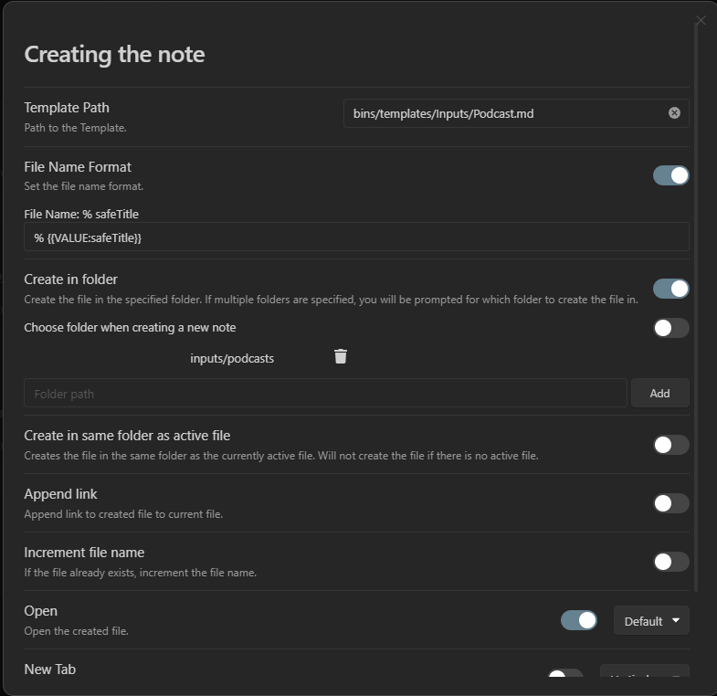

# QuickAdd
I have made some QuickAdd macros & actions that might be helpful to others.

Both of these are seen in the demo:


## Timestamp capture
This is how I capture timestamps so fast in the demo.
You can make a Capture action like so:


The capture format is as follows:
````
\n- **```js quickadd
const pn = this.app.plugins.plugins.podnotes.api;
return pn.getPodcastTimeFormatted("HH:mm:ss", true);
```** | 
````

This captures a new line with the current time, linked to the current podcast, in the active file.

## Add podcast note
This is how I add podcast notes with QuickAdd.
First, you will need my template.

```
---
tags: in/podcast state/process
aliases:
  - "{{VALUE:title}}"
cssclass: null
image: {{VALUE:artworkUrl}}
---

# {{VALUE:title}}
### Metadata
Type:: [[%]]
Tags:: 
Podcast:: [[{{VALUE:podcastName}}]]
Title:: {{VALUE:title}}
URL:: {{VALUE:url}}
Guest:: 
Reference:: 
Reviewed Date:: ==UPDATE THIS==

### Description
> {{VALUE:description}}

---
## Notes

```

Now, you should make a macro with the following script:
```js
module.exports = {
    entry: (params, settings) => {
        const pn = params.app.plugins.plugins.podnotes.api;
        const podcast = pn.podcast;

        if (!podcast) {
            new Notice("No podcast loaded.", 5000);
            throw new Error();
        }

        params.variables = {
            ...podcast,
            ...params.variables,
            safeTitle: replaceIllegalFileNameCharactersInString(podcast.title),
        };
    },
    settings: {
        name: 'Podcast Script',
        author: 'Christian',
        options: {

        }
    }
}

function replaceIllegalFileNameCharactersInString(string) {
    return string
        .replace(/[\\,#%&\{\}\/*<>$\'\":@\u2023\|\?]*/g, '') // Replace illegal file name characters with empty string
        .replace(/\n/, ' ') // replace newlines with spaces
        .replace('  ', ' '); // replace multiple spaces with single space to make sure we don't have double spaces in the file name
}
```

First, create a new macro in the macro panel. This is accessed by clicking `Manage Macros`.
Add a macro with any name you like.

Now, add the script as the first step and the template as the second step.
Adding these requires that the script and template is saved as files in your Obsidian vault.
Their file names are up to you, but ensure that they end in .js and .md, for the script and template respectively.

Once you have created the macro in the macro panel, you should add a macro action to the QuickAdd menu.
This is done from the main QuickAdd settings. You should see an input field where you can input the name of the macro choice.
Right next to it is a dropdown menu with the type of choice you'd like to add—select macro here. Then click `Add Choice`.

Once the choice has been added, you should see the macro in the QuickAdd menu in the settings panel.
Click the cogwheel next to the macro choice to edit the macro. You'll want to select the appropriate macro that you created in the macros panel.
Notably, we distinguish between a macro and a macro choice. Selecting a macro in the menu that pops up 'links' it to the macro choice, so the macro choice can execute the macro.

My settings for the Template action/step in the macro are as follows:


Which means that it creates a file with the podcast episode title as the file name in the `inputs/podcasts` folder, and then opens the file after.

Ultimately, activating the macro will lead to notes like this one.


If you want more information / guidance on how to use QuickAdd, you can check out the [QuickAdd documentation](https://github.com/chhoumann/quickadd/). You can also check out the [video I made to help you get started with QuickAdd](https://www.youtube.com/watch?v=gYK3VDQsZJo).
There are also similar use cases to this one, which all have similar instructions for installation. These may help:

- [How I Import Literature Notes into Obsidian](https://bagerbach.com/blog/importing-source-notes-to-obsidian)
- [Macro: Zettelizer - easily create new notes from headings while keeping the contents in the file](https://github.com/chhoumann/quickadd/blob/master/docs/Examples/Macro_Zettelizer.md)
- [Macro: Toggl Manager - set preset Toggl Track time entries and start them from Obsidian](https://github.com/chhoumann/quickadd/blob/master/docs/Examples/Macro_TogglManager.md)
- [Macro: Fetching movies and TV shows into your vault](https://github.com/chhoumann/quickadd/blob/master/docs/Examples/Macro_MovieAndSeriesScript.md)